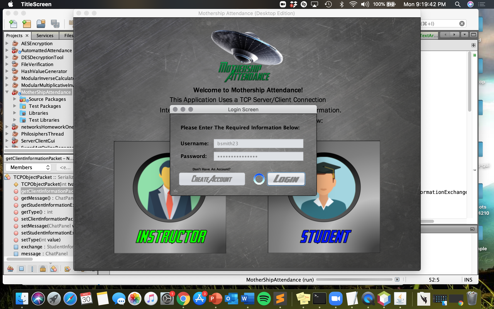

<!DOCTYPE html>
<html lang="en">

<head>
    <meta charset="UTF-8">
    <meta name="viewport" content="width=device-width, initial-scale=1.0">
    <!-- <link href="styles.css" rel="stylesheet"> -->
</head>

<body>
    <main>
        <h1>TCP Automated Attendance (Mothership Attendance)</h1>
        
        
Mothership Attendance is a Java Swing / AWT application which functions as an attendance recording tool for a group of custom created attendee accounts. Other than the previously mentioned process, the application also gives user’s access to four separate features depending on the their selected account type. A list of these additional features is provided below:

    </main>
</body>
</html>
